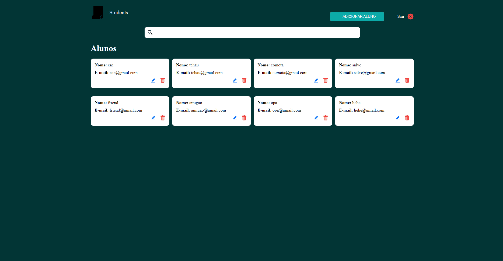

# Projeto Students API (interface)

## Índice

- **[Sobre](#sobre)**
- **[Instruções](#instruções)**
- **[Tecnologias](#tecnologias)**

## Students Interface GIF

## Sobre

Sistema de gestão de alunos. O projeto consume uma [API](https://github.com/guigovaski/csharp-students-api) que possui recursos de autenticação e acesso e gestão de informações de estudantes. O sistema se trata de uma aplicação SPA construída inteiramente em Reactjs, conta com recursos de busca por nomes e validação de erros, também utiliza diversos recursos da biblioteca, como: hooks, componentes, roteamento etc. O codigo do projeto está muito bem organizado, com todas as partes do sistema separadas em pastas. O sistema possui telas de registro, login e a tela principal, na qual só pode ser acessada por usuários autenticados.

## Instruções

Para o projeto funcionar na sua máquina, você deve ter o [Nodejs](https://nodejs.org/en/) instalado, também o [GIT](https://git-scm.com/), e é recomendável possuir uma IDE como o [VSCode](https://code.visualstudio.com/), por exemplo.

### Clone este repositório

`$ git clone https://github.com/guigovaski/react-students-interface.git`

### Para instalar as dependências

`$ npm install`

### Execute o servidor

`$ npm run dev`

## Tecnologias

As seguintes tecnologias foram utilizadas para construir este projeto:

- [React](https://pt-br.reactjs.org/)
    - [React-router-dom](https://reactrouter.com/en/main)
- [Typescript](https://www.typescriptlang.org/)
- [Styled-components](https://styled-components.com/)
